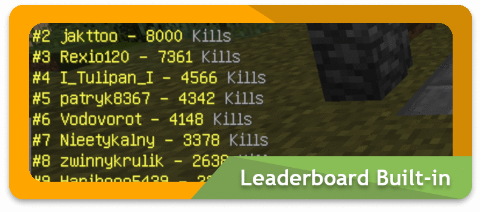

# 村民保卫战

村民保卫战是由 Plajer 制作的一款插件。主要目标是从一波又一波的僵尸的攻势中保护村民的存活，**村民 / 玩家一旦全部阵亡**，游戏也就结束了。

村民保卫战给玩家提供了许多等级分明的职业，其中强弱差距明显，需要玩家花费游戏时间解锁。我们为了方便大家进行快速有效的游戏体验，精心制作了`7`个职业供大家选择。

## 活动时间

?> 这里不会公布活动时间。活动安排将第一时间在[论坛][bbs]发布，请关注我们的论坛😇

## 怎么参加

1. 方式 1：在游戏内输入`/server act2`直接加入游戏服参加活动。
2. 方式 2：在游戏内使用指令`/c`打开 *快捷菜单*，然后点击右下角的 *指南针* 前往保卫村庄活动。

## 加入游戏的正确姿势（重要）

### 步骤一：加入游戏房间

- 方法1：进入游戏服务器后，直走，在游戏大厅找到带有游戏字样的牌子，<kbd>右键点击</kbd> 即可加入。
- 方法2：输入指令`/vd join 房间名`加入指定房间。
- 方法3：输入指令 `/vd randomjoin`随即加入房间人数未满的房间。

### 步骤二：选择职业

#### 方法 1

如果你在等候室，那么右键物品栏第一格的`下界之星`，即可开启选择职业的面板。

#### 方法 2

如果你加入的游戏已经开始了，这时你会处于旁观者视角，必须等待这这一波结束（不是整场游戏）。

!> 在旁观期间 **切勿忘记** 输入`/vd selectkit`来打开职业选择面板选择职业，**否则会自动选择最弱职业。**

### 步骤三：享受游戏吧

- 游戏机制1：打怪升级
  - 击杀僵尸，获得硬币+经验，然后从村民那里购买道具。
  - 商店的排版经过特殊设计，**请购买属于你职业的那一行装备。**
  - 可以通过铁砧和附魔台，强化（更换）自己的武器和装甲，提升战斗力。
- 游戏机制2：专属技能
  - 某些职业有属于自己的专属技能，合理释放技能，为团队做出贡献。
- 游戏机制3：怪物升级
  - 随着波数的增加，僵尸会产生变种。
  - 目前有：普通僵尸，小僵尸，隐形僵尸，铁甲僵尸，钻甲僵尸，工兵僵尸，自爆僵尸。
- 游戏机制4：献祭
  - 击杀僵尸，获得腐肉。
  - 将腐肉投入绿色信标所在地的水池，积累一定数量，即可增加所有玩家的血量上限。
- 游戏机制5：召唤守卫
  - 可以在村民处购买狼和铁傀儡（命名牌图标），他们会自动攻击周围的僵尸。
  - 同时按住潜行+右键他们，可以打开这些宠物的升级面板，花费硬币为他们提升战斗力。
  - 你通过背包内的鞍来移动他们。
- 游戏机制6：团队Buff
  - 击杀僵尸会掉落随机Buff，有这些：
    - 【铁人冲击】在出生点增加`3`个铁傀儡
    - 【精神抖擞】增加`10`秒的生命回复
    - 【双倍伤害】所有伤害提升至2倍
    - 【狂暴无双】所有僵尸一击必杀。

## 职业介绍

**注意，在道具商店中（右键村民即可打开），每种职业都有自己的「推荐装备」。**

如下图

!> ⚠️非远程职业，不要买远程职业的装备⚠️

### 近战职业

- 剑士
  - 普通的近战单位
  - 血量适中
  - 移动速度：正常 近战伤害：中
  - 适用性强，适合新手。
  - 特殊技能（潜能激发）
  - 给予自身一段时间的力量II
- 忍者
  - 高级的近战单位
  - 血量较低
  - 移动速度：快速 近战伤害：高
  - 适合近战非常熟练的玩家
  - 特殊技能（烟雾弹）
  - 无敌`2`秒

### 坦克职业

- 战士
  - 普通的坦克单位
  - 血量较高
  - 移动速度：正常 近战伤害：低
  - 生存能力比较高，被僵尸围殴也不会轻易死亡。
  - 特殊技能（狂怒冲锋）
  - 冲锋`2`秒后，对周围的怪物造成伤害
- 勇士
  - 高级的坦克单位
  - 血量极高
  - 移动速度：缓慢 近战伤害：低
  - 生存能力极高，可以一人面对僵尸海。
  - 特殊技能（狂战士怒吼）
  - 嘲讽周围`20`格的僵尸`5`次

### 远程职业

- 弓箭手
  - 普通的射手单位
  - 血量适中
  - 移动速度：快速 远程伤害：中
  - 非常王道的远程单位，弹速一般。
  - 特殊技能（万箭齐发）
  - 快速射出`5`支`15`伤害的箭
- 步枪手
  - 高级的射手单位
  - 血量适中
  - 移动速度：正常 近战伤害：低 远程伤害：（穿甲)
  - 现代化远程单位，弹速很快，配有格斗匕首，子弹无视护甲。
  - 特殊技能（紧急时刻）
  - 立即往背包添加`1`颗土制手雷和`8`个弹夹

### 法术职业

- 道士
  - 普通的法师单位
  - 血量适中
  - 移动速度：正常
  - 拥有四种独特的法术，辅助队友，是队伍里面必不可少的角色。
  - 枯木回春：给周围`10`格玩家缓慢恢复生命
  - 祝融结界：点燃周围`10`格的僵尸
  - 气脉阻断：减速周围`10`格的僵尸
  - 天神附体：给予周围`10`格的玩家力量II

## 提示&警告

- 非远程职业切勿购买村民商城内的远程武器，由于弹药问题，你花的硬币将毫无意义。
- 坦克职业使用的战斧子也是可以附魔亡灵杀手的，合理给自己的近战武器附魔，合理利用力量药水和游戏内随机掉落的BUFF即可打出高额伤害。
- 步枪手职业的枪械近战也是有伤害的，不过由于射速原因，你的近战冷却较长，在没有弹药的时候或者紧急关头，可以用近战来解围，同时换弹是只要弹夹未满就可以换弹，换弹癌注意节省弹夹,也不要随便右键投掷弹夹。
- 紫色信标处有一个附魔台，可能会有用👻

!> 由于插件的技术原因，无法删除最弱的“骑士”职业，请大家切勿选择该职业。死亡旁观的时候也不要忘记输入`/vd selectkit`来选择职业。

!> 游戏内地上物品除了经验腐肉和食物之外，都无法拾取。切勿丢弃盔甲和买来的装备，这会导致你无法拾取他们。

## 活动奖励

!> 最新的活动奖励请关注[论坛][bbs]！这里只有往届的活动奖励，仅供参考。

共5个榜单，奖励一共7-2种

- 一-参与奖：小血瓶（能自动把闪烁西瓜炼制成瞬间治疗药水的神奇瓶子）
- 二-各榜单Top10奖励：火箭动力充气锤（能把目标锤上60格高）
- 三-各榜单Top1奖励（奖励对应的排行榜暂时保密）
  - 1-不朽之守护（加强版;可充能的不死图腾，放在背包任何地方均会生效）
  - 2-爆能枪（五连发无视伤害间隔的脉冲步枪）【移除】
  - 3-箭雨之弓（弓如其名）
  - 4-引力之甲（会把周围实体向自己牵引并且拥有独特特效的高防御铠甲）
  - 5-IKELOS_霰弹枪_1.0.1版（名字和灵感来自命运2的燃烧霰弹枪）【移除】

[bbs]: https://bbs.mimaru.me "论坛"
