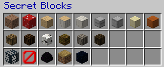
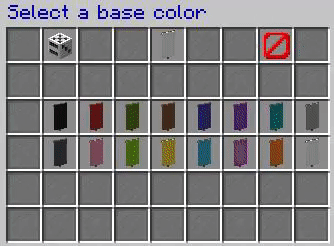
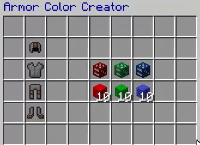

# 建筑师工具

?> 该插件提供了许多方便的小功能，可以协助建筑师更方便的进行建造。

!> 该插件仅限[设计师](/welcome/groups.md#designer)（或更高级权限组）在[创造服](/welcome/servers.md#creative)使用。

## 秘密方块

使用 `/blocks` 获取“秘密方块”。

## 自制旗帜

使用 `/banner` 创建属于自己的旗帜。

## 盔甲调色

你还可以使用 `/color` 编辑盔甲的颜色～

## 其他指令

- `/bu` 打开建筑辅助菜单
- `/nv` 无限夜视

## WorldEdit 指令简化

- `//1` ⇒ `//pos1`
- `//2` ⇒ `//pos2`
- `//c` ⇒ `//copy`
- `//s` ⇒ `//set`
- `//f` ⇒ `//flip`
- `//pa` ⇒ `//paste`
