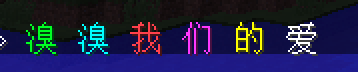

# 聊天

## 颜色代码

简而言之，颜色代码是诸如 `&2`、`&b`、`&m`的特殊符号。

使用颜色代码，可以让 Minecraft 中的文字变成彩色，包括聊天框、告示牌、物品名字、生物名字。

在使用颜色代码之前，你需要知道颜色代码所对应的颜色什么。可以参考：

- 网页 - [颜色代码对照表](https://wiki.ess3.net/mc/)
- 在游戏中输入指令`/nu format`直接查看

颜色代码的使用规则：

- 在代码 *右边* 的文字，都会变成该颜色代码对应的颜色。
- 文字的颜色永远是以离文字 *左边最近* 的颜色代码为准。

如果要达到下面这样的效果：



那么像下面这样使用颜色代码即可

```颜色代码
&a溴 &b溴 &c我 &d们 &e的 &f爱
```

## 聊天频道

> [!tip]
> 频道功能属于[城镇系统](/plugins/towny.md)的一部分功能。

- 世界频道
  - 加入指令`/g`
  - 所有人默认已经加入这个频道，无需再次加入。
- 城镇频道
  - 加入指令`/tc`
  - 进入这个频道后，你说的话只有来自你城镇的人才能看到。
  - 如果你加入了一个城镇，即便不进入这个频道，你依然能看到该频道里信息。
- 国家频道
  - 加入指令`/nc`
  - 进入这个频道后，你说的话只有来自你国家的人才能看到。
  - 如果你加入了一个国家，即便不进入这个频道，你依然能看到该频道里信息。
- 附近频道
  - 加入指令`/lc`
  - 加入这个频道以后，你说的话只有附近`100`格以内的人能看到。
- 管理频道
  - 加入指令`/mod`
  - 加入这个频道以后，你说的话只有风纪委及更高权限组的玩家能看到。
  - 只有[风纪委](../staff.md)（或更高级权限组）有权限加入和收听该频道。
