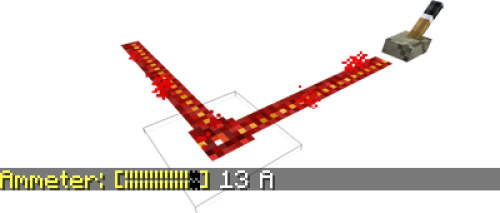
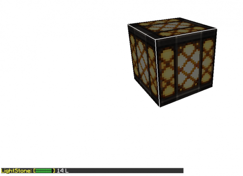
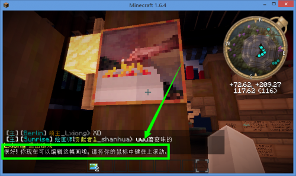

# 机械

该插件可以让你在服务器里建造 *电梯* & *城门*，检测 *光照* & *红石强度*，还有 *快速换画！*

----

## ⚙️电梯

?> 电梯可以让你在不同楼层（高度）之间快速穿行。

电梯（ 点击看大图）只是一些处在不同高度的 *木牌*，所以使用木牌就可以创建一个电梯啦。当然你还需要为电梯建造框架😊。不同层楼的电梯木牌的 *坐标* 除`y`*（高度）*之外，`x`与`z`都必须一致，这样它们才能在楼层之间联系起来。

### 开始建造

木牌里的内容决定了木牌在特定一层中的作用。

!> ⚠️请使用 *橡木牌子*。其他木牌不保证可以正常使用。

- 在牌子的 *第二行* 写上 `[Lift Up]`，那么当玩家点击这个牌子时，会传送到 *正上方* 的 *任何* 有效木牌*。
- 在牌子的 *第二行* 写上 `[Lift Down]`，那么当玩家点击这个牌子时，会传送到 *正下方* 的 *任何* 有效木牌。
- 在牌子的 *第二行* 写上 `[Lift]`，意味着玩家无法点击这个木牌，但你可以配合其他类型的木牌使用。
- 牌子的 *第一行* 可以写上楼层的名字，可以告知玩家到达了哪一层。*第三、第四行* 可为任意内容。

P.s. *有效木牌* 说的是以上三种任意木牌。

#### 多楼层

当有三个及以上的楼层时，就需要用 *两竖列* 的牌子来建造电梯。

下面是一个三层楼的建造方案（ 点击看大图）

| 楼层 | 木牌          | 木牌          |
| ---- | ------------- | ------------- |
| 三楼 | `[Lift Down]` | `无`          |
| 二楼 | `[Lift Up]`   | `[Lift Down]` |
| 一楼 | `无`          | `[Lift Up]`   |

五层楼的建造方案

| 楼层 | 木牌        | 木牌          |
| ---- | ----------- | ------------- |
| 五楼 | `[Lift]`    | `[Lift Down]` |
| 四楼 | `[Lift Up]` | `[Lift Down]` |
| 三楼 | `[Lift Up]` | `[Lift Down]` |
| 二楼 | `[Lift Up]` | `[Lift Down]` |
| 一楼 | `[Lift Up]` | `[Lift]`      |

----

## 🚪城门

?> 城门可以让你在游戏里建造类似中世纪城堡的大型城门！

### 开始建造

!> ⚠️请使用 *橡木栅栏* 和 *橡木告示牌* 来建造城门。其他种类的方块不保证有效。

建造城门只需要：

1. 特定的建筑结构
2. 木牌+特定的文字内容
3. 红石电路*（可选）*

建造方法请在[生存服](/welcome/servers.md)输入指令 `/warp mech-demo` 查看演示。

----

## ⚡️电表

?> 用煤炭右键一段红石电路，可以检测电流强度（范围 `0-15 A`）。

----

## ☀️光感器

?> 用萤石粉右键一个地方，可以检测光照强度（范围 `0-15 L`）。

----

## 🌁换画

?> 先鼠标右键一幅画，然后滚动 `鼠标滚轮` 就可以更换墙壁上的画。

