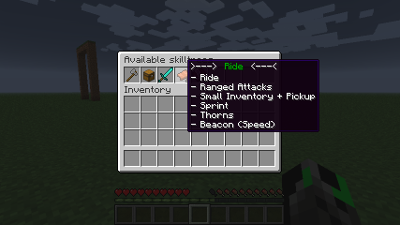
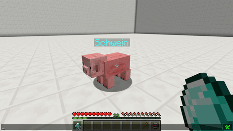
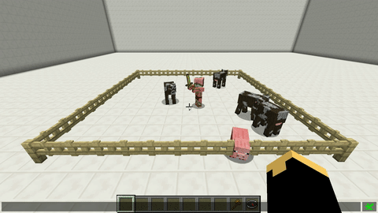
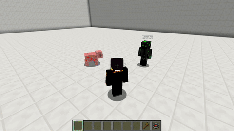

# 宠物

> [!note|label:宠物系统]
>  宠物系统可以让你将一只普通的生物转换为`宠物`。宠物可以冒险时和你一起战斗，探索时充当你的移动背包，甚至是移动信标。部分宠物还可以当成🐴来骑。如果宠物具有飞行属性，你甚至还可以骑着宠物飞行～

?> 如有问题，请先参考[常见问题](#faq)。

?> 补充一个视频教程 [av13697251](https://www.bilibili.com/video/av13697251)。作为玩家只需观看 part1 部分😊。

## 抓一只宠物 :id=how-to-get-a-pet

要获得一只属于自己的宠物，只需简单的几步。

- 第一步 - *找到想要的生物*
  - 想找狼当宠物就去森林🌲，想找北极熊就去雪地☃️，想找末影人就去末路之地🌌……
  - 在开始寻找宠物前，请确保宠物是`可捕获`的。请参考[捕获条件](#leash-flags)。
- 第二步 – *让宠物满足捕获条件*
  - 这一步可能是最难的一步了。具体难度取决于捕获条件和捕获现场的地形/环境等因素。
  - 每一种生物都有一个`捕获条件`，可以在[这里](#leash-flags)查看。
- 第三步 - *去吧大师球！*
  - 当你做好第一步和第二步后，使用`栓绳`点击它，就可以把它转换成宠物了！
  - 转换成功后，你还会看到一条消息："你已成功的制服它，请善待你的宠物！"

!> 不是所有生物直接用栓绳打死就能变成自己的宠物。

## 捕获条件 :id=leash-flags

| 生物种类   | Face                         | 食物           | 捕获条件   |
| ---------- | ---------------------------- | -------------- | ---------- |
| 蜜蜂       | ![蜜蜂][bee]                 | 各种花         | ≤ 10% HP   |
| 蝙蝠       | ![蝙蝠][bat]                 | 蜘蛛眼         | ≤ 10% HP   |
| 烈焰人     | ![烈焰人][blaze]             | 火药           | ≤ 10% HP   |
| 洞穴蜘蛛   | ![洞穴蜘蛛][cavespider]      | 腐肉           | ≤ 10% HP   |
| 鸡         | ![鸡][chicken]               | 小麦种子       | ≤ 10% HP   |
| 牛         | ![牛][cow]                   | 小麦           | ≤ 10% HP   |
| 爬行者     | ![爬行者][creeper]           | 火药           | ≤ 10% HP   |
| 驴         | ![驴][mule]                  | 糖、小麦、苹果 | 已驯服     |
| 远古守护者 | ![远古守卫者][elderguardian] | 糖             | ≤ 10% HP   |
| 守护者     | ![守卫者][guardian]          | 糖             | ≤ 10% HP   |
| 末影龙     | ![末影龙][enderdragon]       | 末地石         | ≤ 10% HP   |
| 末影人     | ![末影人][enderman]          | 灵魂沙         | ≤ 10% HP   |
| 末影螨     | ![末影螨][endermite]         | 粘土           | ≤ 10% HP   |
| 恶魂       | ![恶魂][ghast]               | 火药           | 不可捕获   |
| 巨人       | ![巨人][zombie]              | 腐肉           |            |
| 马         | ![马][horse]                 | 糖、小麦、苹果 | 已驯服     |
| 尸壳       | ![尸壳][husk]                | 腐肉           | ≤ 10% HP   |
| 幻术师     | ![幻术师][illusioner]        | 苹果           | ≤ 10% HP   |
| 铁傀儡     | ![铁傀儡][irongolem]         | 铁锭           | 由玩家创造 |
| 羊驼       | ![羊驼][llama]               | 小麦           | 已驯服     |
| 岩浆怪     | ![岩浆怪][magmacube]         | 红石           | ≤ 10% HP   |
| 蘑菇牛     | ![蘑菇牛][mooshroom]         | 小麦           | ≤ 10% HP   |
| 骡         | ![骡][mule]                  | 糖、小麦、苹果 | ≤ 10% HP   |
| 豹猫       | ![豹猫][ocelot]              | 生鱼           | 已驯服     |
| 猪         | ![猪][pig]                   | 胡萝卜         | ≤ 10% HP   |
| 僵尸猪人   | ![僵尸猪人][zombiepigman]    | 腐肉           | ≤ 10% HP   |
| 鹦鹉       | ![鹦鹉][parrot]              | 小麦种子、曲奇 | 已驯服     |
| 北极熊     | ![北极熊][polarbear]         | 任何生鱼       | ≤ 10% HP   |
| 兔子       | ![兔子][rabbit]              | 胡萝卜、玫瑰花 | ≤ 10% HP   |
| 羊         | ![羊][sheep]                 | 小麦           | ≤ 10% HP   |
| 蠹虫       | ![蠹虫][silverfish]          | 糖             | ≤ 10% HP   |
| 骷髅       | ![骷髅][skeleton]            | 骨头           | ≤ 10% HP   |
| 骷髅马     | ![骷髅马][skeletonhorse]     | 骨头           | ≤ 10% HP   |
| 史莱姆     | ![史莱姆][slime]             | 粘土           | ≤ 10% HP   |
| 雪人       | ![雪人][snowgolem]           | 胡萝卜、雪球   | ≤ 10% HP   |
| 蜘蛛       | ![蜘蛛][spider]              | 腐肉           | ≤ 10% HP   |
| 鱿鱼       | ![鱿鱼][squid]               | 生鱼           | ≤ 10% HP   |
| 流浪者     | ![流浪者][stray]             | 生鱼           | ≤ 10% HP   |
| 恼鬼       | ![恼鬼][vex]                 | 苹果           | ≤ 10% HP   |
| 村民       | ![村民][villager]            | 苹果           | ≤ 10% HP   |
| 女巫       | ![女巫][witch]               | 苹果           | ≤ 10% HP   |
| 凋零       | ![凋零][wither]              | 骨头           | 无法捕获   |
| 凋灵骷髅   | ![凋零骷髅][witherskeleton]  | 骨头           | ≤ 10% HP   |
| 狼         | ![狼][wolf]                  | 生牛肉、生鸡肉 | 已驯服     |
| 僵尸       | ![僵尸][zombie]              | 腐肉           | ≤ 10% HP   |
| 僵尸马     | ![僵尸马][zombiehorse]       | 糖、小麦、苹果 | ≤ 10% HP   |
| 僵尸村民   | ![僵尸村民][zombievillager]  | 腐肉           | ≤ 10% HP   |
| 幻翼       | ![幻翼][phantom]             | 腐肉           | ≤ 10% HP   |
| 海龟       | ![海龟][turtle]              | 海草           | ≤ 10% HP   |
| 海豚       | ![海豚][dolphin]             | 鳕鱼           | ≤ 10% HP   |
| 溺尸       | ![溺尸][drowned]             | 腐肉           | ≤ 10% HP   |
| 鳕鱼       | ![鳕鱼][cod]                 | 海草           | ≤ 10% HP   |
| 三文鱼     | ![三文鱼][salmon]            | 海草           | ≤ 10% HP   |
| 河豚       | ![河豚][pufferfish]          | 海草           | ≤ 10% HP   |
| 热带鱼     | ![热带鱼][tropicalfish]      | 海草           | ≤ 10% HP   |
| 猫         | ![猫][cat]                   | 鳕鱼           | ≤ 10% HP   |
| 狐狸       | ![护理][fox]                 | 羊肉           | ≤ 10% HP   |
| 熊猫       | ![熊猫][panda]               | 竹子           | ≤ 10% HP   |
| 掠夺者     | ![掠夺者][pillager]          | 苹果           | ≤ 10% HP   |
| 掠夺兽     | ![掠夺兽][ravager]           | 牛肉、羊肉     | ≤ 10% HP   |
| 行商羊驼   | ![行商羊驼][traderllama]     | 小麦           | ≤ 10% HP   |
| 流浪商人   | ![流浪商人][wanderingtrader] | 苹果           | ≤ 10% HP   |

<!-- Passive mobs -->

<!-- Peaceful -->
[bee]: https://gamepedia.cursecdn.com/minecraft_gamepedia/e/ed/BeeFace.png ':class=img-32'
[bat]: https://gamepedia.cursecdn.com/minecraft_gamepedia/2/2d/BatFace.png ':class=img-32'
[cat]: https://gamepedia.cursecdn.com/minecraft_gamepedia/a/a2/CatFace.png ':class=img-32'
[chicken]: https://gamepedia.cursecdn.com/minecraft_gamepedia/5/53/ChickenFace.png ':class=img-32'
[cod]: https://gamepedia.cursecdn.com/minecraft_gamepedia/6/66/CodBody.png ':class=img-32'
[cow]: https://gamepedia.cursecdn.com/minecraft_gamepedia/9/93/CowFace.png ':class=img-32'
[donkey]: https://gamepedia.cursecdn.com/minecraft_gamepedia/9/99/DonkeyFace.png ':class=img-32'
[fox]: https://gamepedia.cursecdn.com/minecraft_gamepedia/8/88/FoxFace.png ':class=img-32'
[horse]: https://gamepedia.cursecdn.com/minecraft_gamepedia/5/5e/HorseFace.png ':class=img-32'
[mooshroom]: https://gamepedia.cursecdn.com/minecraft_gamepedia/3/32/MooshroomFace.png ':class=img-32'
[mule]: https://gamepedia.cursecdn.com/minecraft_gamepedia/b/b0/MuleFace.png ':class=img-32'
[ocelot]: https://gamepedia.cursecdn.com/minecraft_gamepedia/6/60/OcelotFace.png ':class=img-32'
[parrot]: https://gamepedia.cursecdn.com/minecraft_gamepedia/3/37/ParrotFace.png ':class=img-32'
[pig]: https://gamepedia.cursecdn.com/minecraft_gamepedia/0/03/PigFace.png ':class=img-32'
[rabbit]: https://gamepedia.cursecdn.com/minecraft_gamepedia/7/71/RabbitFace.png ':class=img-32'
[salmon]: https://gamepedia.cursecdn.com/minecraft_gamepedia/2/2b/SalmonBody.png ':class=img-32'
[sheep]: https://gamepedia.cursecdn.com/minecraft_gamepedia/b/b1/SheepFace.png ':class=img-32'
[skeleton]: https://gamepedia.cursecdn.com/minecraft_gamepedia/d/d5/SkeletonHorseFace.png ':class=img-32'
[squid]: https://gamepedia.cursecdn.com/minecraft_gamepedia/e/ea/SquidFace.png ':class=img-32'
[tropicalfish]: https://gamepedia.cursecdn.com/minecraft_gamepedia/9/9f/TropicalFishBody.png ':class=img-32'
[turtle]: https://gamepedia.cursecdn.com/minecraft_gamepedia/8/8b/TurtleFace.png ':class=img-32'
[villager]: https://gamepedia.cursecdn.com/minecraft_gamepedia/4/4a/VillagerFace.png ':class=img-32'
[wanderingtrader]: https://gamepedia.cursecdn.com/minecraft_gamepedia/8/83/WanderingTraderFace.png ':class=img-32'

<!-- Defensive -->
[pufferfish]: https://gamepedia.cursecdn.com/minecraft_gamepedia/f/fe/PufferfishFace.png ':class=img-32'

<!-- Neutral mobs -->

<!-- Animals -->
[dolphin]: https://gamepedia.cursecdn.com/minecraft_gamepedia/0/0d/DolphinFace.png ':class=img-32'
[llama]: https://gamepedia.cursecdn.com/minecraft_gamepedia/d/d3/LlamaFace.png ':class=img-32'
[panda]: https://gamepedia.cursecdn.com/minecraft_gamepedia/3/33/PandaFace.png ':class=img-32'
[polarbear]: https://gamepedia.cursecdn.com/minecraft_gamepedia/0/07/PolarBearFace.png ':class=img-32'
[traderllama]: https://gamepedia.cursecdn.com/minecraft_gamepedia/d/d3/LlamaFace.png ':class=img-32'
[wolf]: https://gamepedia.cursecdn.com/minecraft_gamepedia/6/68/WolfFace.png ':class=img-32'

<!-- Monsters -->
[cavespider]: https://gamepedia.cursecdn.com/minecraft_gamepedia/6/6b/CaveSpiderFace.png ':class=img-32'
[enderman]: https://gamepedia.cursecdn.com/minecraft_gamepedia/2/2d/EndermanFace.png ':class=img-32'
[spider]: https://gamepedia.cursecdn.com/minecraft_gamepedia/0/05/SpiderFace.png ':class=img-32'
[zombiepigman]: https://gamepedia.cursecdn.com/minecraft_gamepedia/d/d1/ZombiePigmanFace.png ':class=img-32'

<!-- Hostile mobs -->
[blaze]: https://gamepedia.cursecdn.com/minecraft_gamepedia/e/e3/BlazeFace.png ':class=img-32'
[chickenjockey]: https://gamepedia.cursecdn.com/minecraft_gamepedia/a/a9/ChickenJockeyFace.png ':class=img-32'
[creeper]: https://gamepedia.cursecdn.com/minecraft_gamepedia/5/5e/CreeperFace.png ':class=img-32'
[drowned]: https://gamepedia.cursecdn.com/minecraft_gamepedia/8/87/DrownedFace.png ':class=img-32'
[elderguardian]: https://gamepedia.cursecdn.com/minecraft_gamepedia/c/c1/ElderGuardianFace.png ':class=img-32'
[endermite]: https://gamepedia.cursecdn.com/minecraft_gamepedia/8/83/EndermiteFace.png ':class=img-32'
[evoker]: https://gamepedia.cursecdn.com/minecraft_gamepedia/b/b0/EvokerFace.png ':class=img-32'
[ghast]: https://gamepedia.cursecdn.com/minecraft_gamepedia/7/70/GhastFace.png ':class=img-32'
[guardian]: https://gamepedia.cursecdn.com/minecraft_gamepedia/e/e6/GuardianFace.png ':class=img-32'
[husk]: https://gamepedia.cursecdn.com/minecraft_gamepedia/0/05/HuskFace.png ':class=img-32'
[magmacube]: https://gamepedia.cursecdn.com/minecraft_gamepedia/6/69/MagmaCubeFace.png ':class=img-32'
[phantom]: https://gamepedia.cursecdn.com/minecraft_gamepedia/e/ea/PhantomFace.png ':class=img-32'
[pillager]: https://gamepedia.cursecdn.com/minecraft_gamepedia/5/5a/PillagerFace.png ':class=img-32'
[ravager]: https://gamepedia.cursecdn.com/minecraft_gamepedia/a/a9/RavagerFace.png ':class=img-32'
[shulker]: https://gamepedia.cursecdn.com/minecraft_gamepedia/3/32/ShulkerFace.png ':class=img-32'
[silverfish]: https://gamepedia.cursecdn.com/minecraft_gamepedia/4/41/SilverfishFace.png ':class=img-32'
[skeleton]: https://gamepedia.cursecdn.com/minecraft_gamepedia/d/dc/SkeletonFace.png ':class=img-32'
[skeletonhorse]: https://gamepedia.cursecdn.com/minecraft_gamepedia/0/05/SkeletonHorsemanFace.png ':class=img-32'
[slime]: https://gamepedia.cursecdn.com/minecraft_gamepedia/c/ca/SlimeFace.png ':class=img-32'
[spiderjockey]: https://gamepedia.cursecdn.com/minecraft_gamepedia/8/8c/SpiderJockeyFace.png ':class=img-32'
[stray]: https://gamepedia.cursecdn.com/minecraft_gamepedia/0/0f/StrayFace.png ':class=img-32'
[vex]: https://gamepedia.cursecdn.com/minecraft_gamepedia/9/9e/VexFace.png ':class=img-32'
[vindicator]: https://gamepedia.cursecdn.com/minecraft_gamepedia/0/04/VindicatorFace.png ':class=img-32'
[witch]: https://gamepedia.cursecdn.com/minecraft_gamepedia/4/4e/WitchFace.png ':class=img-32'
[witherskeleton]: https://gamepedia.cursecdn.com/minecraft_gamepedia/7/7c/WitherSkeletonFace.png ':class=img-32'
[zombie]: https://gamepedia.cursecdn.com/minecraft_gamepedia/b/b2/ZombieFace.png ':class=img-32'
[zombievillager]: https://gamepedia.cursecdn.com/minecraft_zh_gamepedia/9/9e/ZombieVillagerFace.png ':class=img-32'

<!-- Utility mobs -->
[irongolem]: https://gamepedia.cursecdn.com/minecraft_gamepedia/2/2a/IronGolemFace.png ':class=img-32'
[snowgolem]: https://gamepedia.cursecdn.com/minecraft_gamepedia/5/50/SnowGolemFace.png ':class=img-32'

<!-- Boss mobs -->
[enderdragon]: https://gamepedia.cursecdn.com/minecraft_gamepedia/b/b5/EnderdragonFace.png ':class=img-32'
[wither]: https://gamepedia.cursecdn.com/minecraft_gamepedia/8/84/WitherFace.png ':class=img-32'

<!-- Unused mobs -->
[illusioner]: https://gamepedia.cursecdn.com/minecraft_zh_gamepedia/a/a8/IllusionerFace.png ':class=img-32'
[zombiehorse]: https://gamepedia.cursecdn.com/minecraft_zh_gamepedia/4/46/ZombieHorseFace.png ':class=img-32'

## 宠物商店 :id=pet-shop

?> 打开`宠物宝宝商店`的指令为`/petshop`

在这里你可以直接用`软妹币`购买宠物宝宝哦 (\*/ω＼*)！

## 饥饿系统 :id=hunger-system

饥饿系统基于宠物的饱食度。饱食度的范围在`1`到`100`之间，其中`1`代表最差，`100`代表最佳。在一段时间之后，宠物的饱食度会下降，对你的宠物各项属性造成影响。

### 命中率

当宠物重生之后，如果饱食度低于`90`，那么宠物的命中率不会是`100%`，如下表格：

| 饱食度 | 重生后命中率 |
| ------ | ------------ |
| 100-91 | 100% 命中率  |
| 90-81  | 90%          |
| 80-71  | 80%          |
| 70-61  | 70%          |
| 60-51  | 60%          |
| 50-41  | 50%          |
| 40-31  | 40%          |
| 30-21  | 30%          |
| 20-11  | 20%          |
| 10-2   | 10%          |
| 1      | 1% 命中率    |

### 受饥饿影响的技能

#### 信标

饱食度越低，宠物的信标范围越低。

#### 骑行

饱食度越低，当你骑宠物时骑行速度会越慢。

## 技能树 :id=skilltrees

?> 技能树用来决定宠物的升级和解锁的技能。

你可以想象为玩家的职业（比如骑士和弓箭手）。每只宠物在刚被捕获时可以选择一个技能树作为升级路线，之后技能树不能再更改。随着宠物的打怪升级，宠物将慢慢解锁其所选技能树的更多技能。

## 升级 :id=exp

和玩家一样，宠物也可以通过打怪获得经验值和升级。在特定等级宠物可以解锁一些技能例如`宠物背包`。

经验值转换到等级的方式和玩家的一样（参考[转换公式](https://minecraft-zh.gamepedia.com/%E7%BB%8F%E9%AA%8C%E5%80%BC#.E5.8D.87.E7.BA.A7)）。

## 技能 :id=skills

具体请看官方的[技能列表](https://wiki.mypet-plugin.de/skills)。

## NPC

待编辑...

## 指令 :id=cmds

- 参数说明
  - `<参数>` → 代表这个参数 *必填*
  - `[参数]` → 代表这个参数 *选填*

?> 大多数指令都有`短指令`，比如`/pi`⇔︎`/petinventory`。请尽量使用简单的！

?> 在输入指令时你可以使用<kbd>Tab</kbd>自动补全内容。

## 通用指令

?> `通用指令`适用于所有宠物。

### /mypet

- 显示宠物插件的所有指令。

### /petinfo

- 用法：`/petinfo [玩家名]`
- 显示指定玩家的下列宠物信息:
  - 命中率
  - 经验值
  - 伤害
  - 主人 (当宠物不是你的时)
  - 技能树
- 短指令:
  - `/pinfo`

### /petname

- 用法：`/petname [新的宠物名字]`
- 为你的宠物设置新的名字。
- 你可以用下面的颜色代码让名字变成彩色：
  - `<black>`, `<darkaqua>`, `<darkblue>`, `<darkgreen>`, `<darkred>`, `<darkpurple>`, `<gold>`, `<gray>`, `<darkgray>`, `<blue>`, `<green>`, `<aqua>`, `<red>`, `<lightpurple>`, `<yellow>`, `<white>`, `<magic>`, `<bold>`, `<strikethrough>`, `<underline>`, `<italic>`, `<reset>`

### /petrelease

- 用法：`/petrelease [宠物名]`
- 解放你的宠物，让它回归大自然。

### /petcall

- 用法：`/petcall [宠物名]`
- 召唤你的宠物到你的身边。
- 短指令：
  - `/pc`
  - `/petc`

### /petsendaway

- 暂时把你的宠物送走。
- 之后你仍可以使用`/petcall`把宠物召回。
- 短指令：
  - `/psa`
  - `/petsa`

### /petrespawn

- 用法：`/petrespawn [pay 或 show 或 auto]`
- 显示下列关于你的或其他玩家的宠物信息。
  - auto 后面可填写一个`整数`来设置你想支付的最长时间（单位`秒`）。
  - 比如，如果使用的是`/petrespawn auto 10`，然后宠物死了（其重生时间为`16`秒），那么宠物系统会先等重生时间转到`10`秒，并且主人能够支付重生费时，再复活宠物。
  - 短指令：
    - `/petr`
    - `/pr`

### /petswitch

- 在你拥有的宠物之间切换宠物。
- 短指令：
  - `/pswitch`

### /petstore

- 可以让你把宠物存起来。
- 被存起来的宠物可以使用指令`/petswitch`来取出。
- 短指令：
  - `/pstore`
  - `/pst`

### /pettrade

- 用法：
  - `/pettrade [accept 或 reject 或 cancel 或 <玩家名>] <交易价格>`
  - `accept`= *接受*；`reject`= *拒绝*，`cancel`= *取消*
- 把你当前的宠物与其他玩家交易.
- 短指令：
  - `/pett`
  - `/pt`

### /petskill

- 用法：`/petskill [玩家名]`
- 显示自己宠物的技能树信息。
管理可通过该指令查看其他玩家的宠物的技能树信息

### /petstop

- 使宠物停止攻击目标。
- 在农场和侵略行为模式中无效。
- 短指令：
  - `/ps`
  - `/pets`

### /petskilltree

- 用法：`/petskilltree <怪物类型> [技能树名]`
- 查看指定物种的可用技能树。
- 查看指定物种的技能树包含的技能和等级。
- WIP.

### /petchooseskilltree

- 用法：`/petchooseskilltree [技能树名]`
- 显示所有可用的技能树，并让你为你的宠物选择一个技能树。
- 可以理解成为你的宠物选择一条职业发展路线。
- 短指令：
  - `/pcst`
  - `/petcst`
- 使用该指令后会出现一个箱子界面，如下图：

### /petcapturehelper

- 启用/禁用 CaptureHelper
- 短指令：
  - `/pch`

### ~~/pettype~~

!> 该指令不再可用。要查询捕获条件请参考[这里](#leash-flags)。

- 用法：`/pettype <宠物类型>`
- 显示关于宠物的信息，如`默认HP`、`捕获条件`、`食物`

### /petoptions

- 用法：`/petoptions <选项> [参数…]`
- 选项:
  - `healthbar`：开启/关闭健康条
  - `idle-volume`：设置闲置声音宠物的音量
  - 参数:
    - `<百分比>`

## 技能指令

?> `技能指令`能否使用取决于宠物的技能树和已解锁的技能。

### /petinventory

- 用法：`/petinventory [玩家名]`
- 打开宠物的物品栏（如下图）。
- 宠物在水/熔岩中时不能打开。
- 打开另一个玩家的宠物物品栏需要`mypet.admin`权限节点
- 短指令：
  - `/pi`
  - `/peti`

### /petpickup

- 开启/关闭宠物自动拾取（如下图）。
- 至少需要一整排空的物品栏，宠物才会拾取物品
- 短指令：
  - `/pp`
  - `/petp`

### /petbehavior

- 用法：`/petbehavior [模式]`
- 切换宠物行为（如下图）
- 模式:
  - `friendly(友好)` → 不战斗，即使自己被攻击
    - friend
  - `normal(普通)` → 像普通狼一样
  - `aggressive(好战)` → 攻击玩家15格范围内所有的生物
    - aggro
  - `farm(打野)` → 攻击玩家15格范围内所有的怪物
  - `raid(突击)` → 如同普通模式，但宠物不会攻击玩家及其宠物(狼，豹猫，宠物)
  - `duel(决斗)` → 宠物将在半径5格范围内攻击具有决斗行为的其他宠物
- 短指令：
  - `/pb`
  - `/petb`

### /petbeacon

- 打开宠物的信标技能窗口 （点击查看大图）。
- 默认情况，当信标开启时会持续消耗宠物的饥饿值。️
- 短指令：
  - `/pbeacon`
  - `/petbeacon`

## 管理指令

?> `管理指令`仅限服务器OP使用。

### /petadmin

- 用法：`/petadmin <选项> [参数…]`
- 只有拥有`mypet.admin`权限的玩家可使用该指令。
- 选项:
  - `name`
    - 设置指定玩家的宠物名字。
    - 参数:
      - `<拥有者>`
      - `<新名字>`
  - `exp`
    - 设置指定玩家的宠物经验值。
    - 参数:
      - `<拥有者>`
      - `<数值>`
      - `[add/set/remove]`
      - P.s. `add`为增加，`set`为设置指定数值，`remove`为扣除。
  - `respawn`
    - 显示/设置指定玩家的宠物的重生时间。
    - 只改变死亡宠物的重生时间。
    - 参数:
      - `<拥有者>`
      - `[新的重生时间（单位：秒）]`或`[show]`
  - `reload`
    - 重载配置文件（`config.yml`）
    - 参数：
      - `all`
      - `config`
      - `skilltrees`
  - `reloadskills`
    - 重载技能树
  - `skilltree`
    - 更改指定宠物的技能树。
    - 参数:
      - `<宠物拥有者>`
      - `<技能树>`
  - `build`
    - 显示 MyPet 版本。
  - `create`
    - 为指定玩家创建新的宠物。
    - 玩家有主宠物时不可用。
    - 使用 `-f`创建一个新的宠物（即使玩家已经有一个宠物）。
    - 参数:
      - `[-f]`
      - `<拥有者>`
      - `<宠物类型>`
      - [参数]
    - 使用<kbd>Tab</kbd>查看选定宠物类型的所有可用参数。
  - `clone`
    - 克隆一个玩家的宠物给另一个玩家
    - 参数:
      - `<宠物拥有者>`
      - `<新的宠物拥有者>`
  - `remove`
    - 删除指定玩家的宠物
    - 参数:
      - `<拥有者>`
  - `cleanup`
    - 删除超过一定时间的未使用的宠物
    - 在升级到 MyPet 1.1.3 之后，如果未指定参数，所有宠物未使用（存疑）(原文：if no parameter is given all pets which aren't used after the upgrade to MyPet 1.1.3)
    - 参数（示例）:
      - `[1Y]` `[1D]` `[1H]` `[1M]`
  - `ticket`
    - 创建一个ZIP文件，其中包含了在 [GitHub](https://github.com/xXKeyleXx/MyPet/issues) 上提出问题时开发人员需要的所有信息。

## 常见问题 :id=faq

### 有最大经验值上限吗

有。每只宠物的最大`经验值`为`17647`。达到此数值后将不再获得新的经验值。

### 如何给僵尸/骷髅/僵尸猪人穿装备

!> 装备只有视觉效果，没有防御加成等实际作用

拿着装备<kbd>Shift</kbd><kbd>鼠标右键</kbd>宠物即可。要移除装备，拿着剪刀<kbd>Shift</kbd><kbd>鼠标右键</kbd>宠物。

### 如何在骑宠物的时候控制它

骑宠物就像骑带有鞍的🐎一样。

### 如何让宠物飞起来

1. 宠物需要有`Ride(骑乘)`技能树
2. `fly`属性在技能树里必须开启
3. 然后骑上你的宠物
4. 按下<kbd>空格</kbd>

### 如何得到一只宠物

👉[抓一只宠物](#how-to-get-a-pet)

### 如何喂宠物

首先从[这里](#leash-flags)查看宠物需要吃什么，然后拿着正确的食物<kbd>鼠标右键</kbd>宠物即可喂食。喂食后，你首先会看到宠物提升了[饱食度](#hunger-system)（每个食物相当于`6`点饱食度）。当饱食度到`100`时，继续喂食将治疗宠物。每个缺少的饱食度和生命值将使用`1`点饱食度（？）。

### 可以有两只宠物吗

不可以。你只能同时拥有一只 *活跃* 的宠物。不过你可以把宠物存起来，然后在他们之间切换（使用[指令](#petswitch)或[NPC](#NPC)）。

### 为什么我的宠物不会攻击

因为你的宠物没有伤害技能（[伤害][skill-damage]或[远程][skill-ranged]）。选择一个带有伤害的[技能树](#skilltrees)就好啦。

[skill-damage]: https://wiki.mypet-plugin.de/skills/damage
[skill-ranged]: https://wiki.mypet-plugin.de/skills/ranged

### 为什么我不能驯服末影龙/凋零

服务器的设定为凋零无法捕获。

末影龙的话需要服务器安装[ProtocolLib](https://www.spigotmc.org/resources/protocollib.1997/)插件。然而该插件存在降低服务器TPS的嫌疑，现已暂时移除。

### 为什么末影龙/蝙蝠/幻翼...看起来在走路

这是因为 Minecraft 没有`飞行AI`。

在生物变成宠物后，宠物插件会将生物的AI替换成`宠物狼AI`。宠物狼不会飞，因此宠物也不会飞。玩家骑宠物飞行另当别论，那不是宠物自己在飞，而是玩家在控制。

### 可以让宠物坐下吗

你可以用<kbd>Shift</kbd><kbd>鼠标右键</kbd>宠物来让它坐下 *呆在原地*。

你可以命令所有宠物 *呆在原地*，不局限于可驯服的生物（e.g. 猫🐱狼🐺）。
