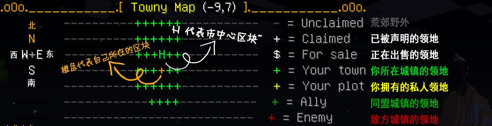

# 城镇常见问题

## 城镇相关

### 加入城镇的所有方式

* 方式1：找一个开放的城镇，然后输入`/town join {城镇名}`
* 方法2：在人多的地方喊话，叫人邀请你入城
  * 假设你收到了一个入城邀请，
  * 输入`/accept {城镇名}`或
  * `/town invite accept {城镇名}`
  * 来接受邀请
* 方式3：直接问特定城镇内的居民
  * 找到你想加入的城镇（的名字）
  * 输入`/town online {城镇名}`来查看城镇内有谁在线
  * 问他是否可以拉你加入他们的城镇
* 方式4：
  * 浏览茶馆的[城镇专栏](https://bbs.mimaru.me/t/towns)
  * 查看每个帖子，看是否留下了什么联系方式
* 方式5：
  * 在我们的[QQ群](http://shang.qq.com/wpa/qunwpa?idkey=6bf79ba005ae8c932177afa1f64ac96d0e6bf7c59f8c393b0f9ef8f3f69d6f15)里喊话

### 如何增加城镇领地上限

* 方式一：邀请更多玩家加入你的城镇
  * 城镇的每个居民都会为城镇提供 +9 的领地数量上限
* 方式二：购买领地上限
  * 使用指令`/town buy bonus {区块数}`购买领地上限，
  * 每单个区块上限的价格与声明领地的价格相同
* 方式三：加入国家
  * 国家会给其下属城镇提供领地上限的加成

### 如何修改 /town spawn 的位置

修改输入`/town spawn`后到达的位置，也就是修改城镇的 *重生点*。输入`/town set spawn`即可调整城镇重生点的位置。请注意，城镇的重生点必须要设置在叫做 *市中心* 的区块里；市中心可以用`/town set homeblock`来进行调整（将调整为当时输入指令时所在的区块）。

### 如何声明不接壤的区块

要声明不接壤的区块，可以把区块声明为 *前哨站*，指令是`/town claim outpost`。具体的做法是，先站在你想圈的区块里，然后再输入这个指令，即可把脚下的区块声明为前哨站。请注意，这样圈一块地（前哨站）会花费与 *建城费* 同等的软妹币。

一旦前哨站声明成功，城主就可以挨着前哨站继续用`/town claim`来圈地了，以节省软妹币。居民们可以用`/town outpost {序号}`直接传送到前哨站。{序号} 从 1 开始算。如果你要重新调整前哨战传送点的位置，先站在理想中的位置，然后输入`/town set outpost`即可。

### 城镇的领地单位

城镇的领地单位不是 1×1×1 的方块，而是 16×16×256 的 *区块*。城镇系统下的世界可以看做是被分割成了无数个 16×16×256 的[区块](https://minecraft-zh.gamepedia.com/%E5%8C%BA%E5%9D%97)（点击查看 Wiki 介绍），这也是领地的最小单位。

### 如何寻找区块的边界

在游戏中你可以用<kbd>F3</kbd><kbd>G</kbd>把 *区块边界* 显示出来，这样就能精确的操作领地了～

| 边界显示关闭 | 边界显示打开 |
| - | - |
|  |  |

### 如何确定城镇的领地范围

* 方式一：使用卫星地图
  * 打开[卫星地图](http://map.mimaru.me:8123/)
  * 找到带有你城镇名字的图标
  * 蓝色半透明域就是城镇的领地范围
  * 
* 方式二：使用城镇地图
  * 在游戏中面朝北方（为了你的方便）
  * 输入`/towny map`查看城镇地图
  * 输入`/towny map big`可以查看大号的地图
  * 
    * "+" 代表 *默认地皮*
    * 字母代表 *特殊地图*，例如 F 是农场，E 是大使馆，J 是监狱等等

### 被苦力怕炸毁的方块会自动恢复

这是城镇插件的 *回溯功能*。当苦力怕、火球等实体破坏了地形时，若干秒之后地形会以缓慢的恢复原貌。回溯只会发生在荒郊野外。请注意，所有蕨类植物方块都会回溯成枯木；移动中的方块（如活塞臂）被回溯之后，会留下 *隐形的方块*。这种方块玩家可以穿过去，但无法在这些方块的位置上放置方块，也无法在生存模式下清除，只有 OP 使用 WorldEdit 才能够清除。这些是 bugs，尚未修复。

## 国家相关

### 城镇加入国家的好处

**领地奖励**

加入了国家的城镇可以获得额外的 *领地数量上限* 和 *前哨战数量上限*。随着国家等级的提高，加成越多。也就是说，国家可以缓解城镇领地上限的瓶颈，让城镇更轻松地得到大片的领地，减轻城镇建筑方面的取地困难。

**国有领土**

国家的 *首都* 会自动拥有 *国有领土*。国有领土是城镇领地边缘向外延伸 1 区块的区域。只有国家内的居民有权限在国有领土里进行建造、破坏、交互。

### 国家的维护费

每天的12点国家需要缴纳维护费，从国家银行中扣取。维护费的计算公式为`100×国家下属城镇数`。如果国家担负不起维护费，则被自动解散。解散后对下属城镇的领地上限奖励会消失，但不会导致城镇的已圈领地消失。

### 如何关闭联盟的权限

城主输入指令`/town set perm ally off`即可。注意权限的开关并不是双向生效的。例如，城镇 A 和 B 都属于国家 G；原本 A 和 B 都对其联盟开放权限；后来 A 的城主输入了上面的指令关掉了权限，那么结果是 B 失去了 A 的权限，但 A 仍然拥有 B 的权限。
