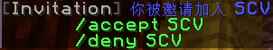

# 城镇

城镇插件可以让玩家在游戏世界里创建城镇、占领区块、建立国家。

?> 如有疑问，先看一下 [常用指令](#common-cmds) & [常见问题](/plugins/towny-faq.md) 中有没有答案 ^ ^

## 什么是城镇

城镇是玩家在游戏世界中占领的 *区域*，也叫做 *城镇领地*，其中有他们的建筑、设施等。城镇领地之外的地方叫做 *荒郊野外* —— 这些地方强制开启PVP且有爆炸伤害。在上古时代，城镇通常也象征着志趣相投的玩家团体。

作为新人，你可以选择加入一个城镇（居民向），也可以自己创建一个（镇长向）。

## 加入城镇（居民向）

加入城镇即 *加入别人的城镇*。加入城镇一般需要城镇的 *城主* 和 *助理* 邀请你来完成。你可以在游戏内喊话或QQ群来联系到他们。城主或助理门输入`/town add {你的游戏ID}`就可以邀请你加入他们的城镇。收到邀请的玩家会看到如下提示：

这时你输入`/accept {城镇名}`表示接受入城邀请，`/deny {城镇名}`表示拒绝。

**0x1 居民常用指令**

👉[见这里](#common-cmds)

## 创建城镇（镇长向）

创建城镇即 *自己创建城镇*，这包括创建城镇、扩张城镇领地、邀请其他玩家加入你的城镇。

**0x1 创建城镇**

!> 请确保你的城镇名字不包含空格、中文、特殊字符。

创建城镇的玩家将自动成为城镇的 *城主（镇长）*。创建城镇需要软妹币，你可以输入`/towny prices`看到`[New] Town: X$`一项，这就是建城费。如果你的软妹币足够，就可以开始创建城镇了。输入`/town new {城镇名}`即可在 *当前位置* 创建一个城镇。请确保在输入该指令前，你当前的位置坐标是你想建城的地方。你可以通过[卫星地图](http://map.mimaru.me:8123)找一个合适的地方落户。

创建好城镇后，你*（镇长）*以及属于你城镇的居民们，都可以输入指令`/town spawn`直接传送回自己的城镇。

**0x2 扩张城镇的领地**

刚刚创建的城镇领地大小只有一个区块。要扩张你的城镇领地，输入指令`/town claim`。这个指令可以把 *你脚下的区块* 声明为 *你的城镇领地*（前提是要声明的区块必须与你现有的城镇领地 *接壤*）。重复输入该指令即可不断扩张领地。圈地需要软妹币，记得输入`/town deposit`往你的城镇银行存些软妹币 <3

**0x3 邀请其他玩家加入你的城镇**

*城主* 或 *助理* 输入`/town add {你的游戏ID}`就可以邀请其他玩家加入自己的城镇。

**0x4 镇长常用指令**

👉[见这里](#common-cmds)

## 加入国家（镇长向）

玩家们组成 *城镇*；许多城镇组成 *国家*。国家只能由城镇的 *镇长* 创建；创建国家的那个城镇会自动成为国家的 *首都*；创建国家的镇长会自动成为 *国王*；创建国家的那个城镇会自动加入创建的国家。一旦城镇加入了国家，将会获得国家给予的各种好处。属于国家的居民可以输入`/nation spawn`传送到首都。同一国家下的所有城镇自动互相成为 *联盟*，联盟间默认共享城镇领地的方块建造和破坏权限（可关闭）。

作为城镇的镇长，你可以选择 *加入现有的国家*，也可以 *自己创建新的国家*。

**选项一：创建一个新国家**

创建国家的基本步骤：

1. 输入`/towny prices`来查看你的城镇是否能支付起`[New] Nation`一项（也就是建城费）。
2. 如果可以，输入`/nation new [名字]`即可创建一个国家。**名字必须为英文/字母/数字，不可包含空格。**
3. 输入`/nation deposit [数额]`往国家银行里存钱，让国家担负得起维护费。
4. 输入`/nation add [城镇名]`即可邀请一个城镇加入你的国家。被邀请的城镇的 *城主* 需要使用以下指令来接受或拒绝邀请：
   * 受邀城主输入`/t invite accept {国家名}`表示同意加入国家。
   * 受邀城主输入`/t invite deny {国家名}`表示拒绝。

**选项二：加入现有的国家**

1. 首先确认你想加入哪个国家。
2. 让对方的城主或外交大臣输入`/nation add [城镇名]`邀请你加入他们的国家。在你被邀请后，使用以下指令来接受或拒绝邀请：
   * 受邀城主输入`/t invite accept {国家名}`表示同意加入国家。
   * 受邀城主输入`/t invite deny {国家名}`表示拒绝。

## 等级

**0x1 城镇等级**

*城主* 可以设置城镇内居民的等级。设置居民等级可以让你限制居民的一些行为，也可以让你授予个别居民一些特权，来协助你一起管理城镇。设置居民等级的指令如下

    /town rank {add/remove} {玩家名} {等级名(请用英文)}

可用等级有这些

* **平民 Resident** - 加入城镇后的默认等级
* **好人 Good** - 拥有城镇内所有私人领地的所有权限
* **助理 Assistant** - 可以邀请其他玩家加入城镇

**0x2 国家等级**

同样 *国王* 可以设置国家内居民的等级。指令如下

    /nation rank {add/remove} {玩家名} {等级名(请用英文)}

可用等级有这些

* **财务大臣 Banker** - 从国家银行取钱、设置国家税收
* **外交部长 Fa** - 邀请城镇加入国家、添加/删除盟国

## 常见问题 & 解答

👉[点击查看](/plugins/towny-faq.md)

## 常用指令 :id=common-cmds

### 0x1 居民向

* 指令 `/town`可以简写为`/t`，
  * 例如`/town spawn`⇔`/t spawn`。
* 指令`/plot`可以简写为`/p`，
  * 例如`/plot claim`⇔`/p claim`

| 指令                                | 说明                   |
| ----------------------------------- | ---------------------- |
| /town spawn {城镇名}                | 传送到指定城镇的重生点 |
| /town outpost {序号}（从 1 开始数） | 传送到自己城镇的前哨站 |
| /town deposit {数额}                | 存钱到自己的银行       |
| /town leave                         | 退出城镇               |
| /town list                          | 查看所有的城镇列表     |
| /town                               | 查看自己城镇的信息面板 |
| /town {城镇名}                      | 查看其它城镇的信息面板 |
| /towny map                          | 查看城镇地图           |
| /towny map big                      | 查看大号的城镇地图     |
| /towny prices                       | 查看城镇系统的各项费用 |
| /g                                  | 加入世界聊天频道       |
| /tc                                 | 加入城镇聊天频道       |
| /nc                                 | 加入国家聊天频道       |
| /lc                                 | 加入附近聊天频道       |

### 0x2 镇长向

| 指令                     | 说明                      |
| ------------------------ | ------------------------- |
| /town add {玩家}         | 邀请居民加入你的城镇      |
| /town kick {玩家}        | 将指定居民踢出你的城镇    |
| /town claim              | 把脚下的区块圈为城镇领地  |
| /town claim outpost      | 把脚下的区块圈为前哨站    |
| /town set outpost        | 设置当前前哨战的传送点    |
| /town buy bonus {区块数} | 购买指定数量的领地上限    |
| /town unclaim            | 解除脚下城镇领地 / 前哨战 |
| /town deposit {金额}     | 往城镇银行里存钱          |
| /town withdraw {金额}    | 从城镇银行里取钱          |
| /town set spawn          | 设置城镇的重生点          |
| /town set name {名字}    | 更改城镇的名字            |
| /town set mayor {玩家}   | 将镇长转让给指定居民      |
| /town delete             | 解散自己的城镇            |

## 所有指令

👉[点击查看](/plugins/towny-cmds.md)

## 其他链接

* [http://mineplugin.org/Towny](http://mineplugin.org/Towny)
