# 上古梗

!> WIP.

----

## 🧶后天事件

后天……也称无尽的后天，在上古服内通常表达无限远的未来，拆开词语可以理解为“以后的某天”。来源于1.4到1.5的服务器更新时，某二货（*那个二货的名字叫可乐，因为抖M之魂觉醒，所以跑来编辑这个词条了）*不断地说后天就会开服……后天就会开服，可是服务器却迟迟不开，从此“后天”就成为了上古的一个梗。

### 起源

世界由神所创，神拥有无尽的创世之力，神说：“后天将会诞生一个完整的世界”。
然后便化作了三大原灵。
三大原灵各自拥有庞大的创世之力。
第一天，第一原灵创造了天地万物，创造了空气、水、火、泥土、岩石、矿物。

第一原灵下令：
“空气可以存在于任何地方，水是冷的、可以流动的，火是热的、可以扩散的，泥土是松软的，岩石是坚硬的，矿物散落于岩石之中。”
至此，第一原灵将残存的创世之力化为世界之基石和天空之封印，世界之基石支撑起世界，天空之封印保护住世界。
第一原灵说：“后天将会诞生一个完整的世界”，然后便安息了。
第二天，第二原灵创造了世间生命，创造了青草、树木、藤蔓、动物，人类。

第二原灵下令： “青草可以存在于泥土上，树木需要有足够的空间，藤蔓可以攀附于峭壁，动物可以自由行动，人类可以直立活动。”
至此，第二原灵将残存的创世之力化为太阳和月亮，太阳带来生命，月亮带来死亡，将太阳置于世界正面，月亮置于世界背面。
第二原灵说：“后天将诞生一个完整的世界”，然后便安息了。
第三原灵创造了人类灵魂，赋予人类智慧和判断。

第三原灵下令： “人类可以用树木制造工具，用材料建造房屋，用植物饲养动物，用木头点燃火焰，用火焰熔炼金属，用水扑灭火焰。”
第三原灵想到：“如果太阳和月亮是静止的，后天便永远不会来临。”
于是第三原灵推动太阳和月亮围绕世界转动，站在山顶看遍世界的每一个角落。
日月交替四次之后之后，世界上生机勃勃，人类努力的种植作物，饲养动物，开采矿物，制造房屋……
第三原灵看着这个世界说：“后天，这个世界将会灭亡”，然后便安息了。
人类听到了第三原灵的话，十位智者聚集在一起，商谈之后，说：“两天之后才是后天”
第二天，十位智者又告诉大家：“两天之后才是后天”
大家便明白了，后天永远不会来临，世界将会运作下去……
于是，世界无比繁荣……
但是……完整的世界永远也不会诞生，因为这个世界永远都没有后天……

—节选自创世录*（可乐所著，上古服内仅有三套此系列书籍，讲述了上古世界的起源和演变）*

----

## 🐯可乐脸

可乐脸，具有多种不同的解释，在上古群内通常解为可乐*（上古服内著名玩家、高阶设计师，Eden之主，著有《创世录》等书籍）*的头像，也就是一只莫名很萌的老虎头像。

### 起源

关于“可乐脸”一词的起源众说纷纭，故而在不同场景下的词义也不同，笔者列出的只是几个流传较广的说法：

> “妹子的昵称，可乐的脸”

一些人认为，“可乐脸”一词最早由上古服玩家Zeal*（上古服内玩家，原Deng城城主，管理着红魔馆建筑群）*在上古群内使用，当时的发言如下图所示：

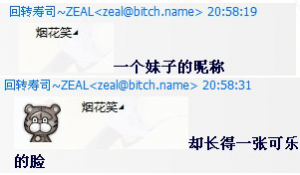

> 戴上面具，就是伊甸之主。

古服内有一个传说：伊甸王国的国王虽然名义上是可乐，但是实际上，可乐只是一张面具，谁戴上这张面具，谁就是伊甸之主，谁就拥有国王的权力，但是从来没人知道……现在戴着面具的那个人究竟是谁，而那张面具就被人们称之为“可乐脸”。

### 可乐脸系列表情

由HUHU79*（Eden王国的雕塑师，擅长动物类雕塑，作品有“休斯顿狮鹫像”等）*和Casdy*（Eden王国的高阶设计师之一，塔利亚城主，作品有遗弃灯塔等）*等人带头恶搞可乐的头像，后逐渐发展成一个系列表情，在上古群内流传使用，现在依然有人不断添加完善这个系列。这套表情的特点在于：全部基于可乐的老虎头像修改而成，可卖萌可鬼畜，简直无所不能，故而被大家广泛接受。


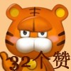


----

## 🥳小Q好妹妹

大Q*（大Q为上古服管理又为塔利亚吉祥物）*，他是一个管理，又是一个管理。人常言：一语惊醒梦中人。

而某日。某人一句谈笑却变成了历史性的一句话。它推动了上古服精神上的发展与进步。即使笔者(觉得这是毫无意义的精神水平提高。而关键的极具意义性这促使了大Q多了个妹妹，或者说他自己变成了自己的妹妹。而唯一庆幸的是妹妹小Q只喜欢N卡。

### 语录

- 来源：这是Casdy从“潮流好妹妹=w=~~”的句式引申而成的。
- 句式：主语+形容词+颜文字
- 例子：小q好妹妹~\(≧▽≦)/~（此为原句）
- 引申：小q好少女~\(≧▽≦)/~
- 呐喊：为了增加气势，一般都以此规格呐喊，方正规整，掷地有声

```moe
小q好妹妹~\(≧▽≦)/~ 小q好妹妹~\(≧▽≦)/~ 小q好妹妹~\(≧▽≦)/~
小q好妹妹~\(≧▽≦)/~ 小q好妹妹~\(≧▽≦)/~ 小q好妹妹~\(≧▽≦)/~
小q好妹妹~\(≧▽≦)/~ 小q好妹妹~\(≧▽≦)/~ 小q好妹妹~\(≧▽≦)/~
小q好妹妹~\(≧▽≦)/~ 小q好妹妹~\(≧▽≦)/~ 小q好妹妹~\(≧▽≦)/~
小q好妹妹~\(≧▽≦)/~ 小q好妹妹~\(≧▽≦)/~ 小q好妹妹~\(≧▽≦)/~
小q好妹妹~\(≧▽≦)/~ 小q好妹妹~\(≧▽≦)/~ 小q好妹妹~\(≧▽≦)/~
小q好妹妹~\(≧▽≦)/~ 小q好妹妹~\(≧▽≦)/~ 小q好妹妹~\(≧▽≦)/~
小q好妹妹~\(≧▽≦)/~ 小q好妹妹~\(≧▽≦)/~ 小q好妹妹~\(≧▽≦)/~
小q好妹妹~\(≧▽≦)/~ 小q好妹妹~\(≧▽≦)/~ 小q好妹妹~\(≧▽≦)/~
```

### 威严四射的大Q

- 以查水表著称，发怒时会吐出一句“已移除”，左握咸鱼，右持N卡。近日大Q已被玩坏。（外表请参考天子男化）
- 性别：男
- 住处：塔利亚
- 年龄：18岁
- 危险度：中（发怒后为高）
- 与人类友好程度：高

#### 口述证词

“他喜欢四处游走，宣传N卡。虽然我对N卡也颇有兴趣，不过我想那不会是查水表的计策吧。” *——摘自：路人甲*  
“每次一提到我的好A卡就被疯狂吐槽。” *——摘自：Sange*  
“卧槽啊，大Q居然不是Queen。” *——摘自：Saya*  
“小Q和大Q有什么区别？不会是……同一人吧？” *——摘自：某玩家*

#### 对付策略

经过笔者观察大Q的整体危险度不高，如果遇到只要不褒扬A卡贬低N卡即可，而且大Q非常喜欢天子，目测以天子表情卖萌就能与他和谐交谈。
不过违法上古法典全家都会被查水表，切勿犯禁忌。

### 傲娇的小Q

- 以傲娇著称，称呼时可简略为“少女”或“好妹妹”，而此时她也会口嫌体正直。
- 不过笔者建议还是少调戏，玩坏的下场可是被大Q查水表。（外表请参考天子原型）
- 性别：女
- 住处：塔利亚
- 年龄：14岁
- 危险度：低
- 与人类友好程度：高

#### 口述证词

“小Q好妹妹！” *——摘自：Kive*
“小Q的威严也爆发了！” *——摘自：CendeleNya看到小Q宣传N卡后*
“还有，我不是吉祥物。” *——摘自：小Q本人看到Casdy在编辑Talia词条后的傲娇吐槽*
“大Q受宠若惊，不自觉露出了本性。” *——摘自：RdMapleKun*

#### 对付策略

经过笔者观察大Q的整体危险度不高，如果遇到只要不褒扬A卡贬低N卡即可，而且大Q非常喜欢天子，目测以天子表情卖萌就能与他和谐交谈。不过违法上古法典全家都会被查水表，切勿犯禁忌。

----

## 🙆‍♀️山花好妈妈

山花好麻麻，本名山花(shange)又可戏称为三个、shanhua、母上大人、山小姐、林夫人、fafa*（说起fafa由来，似乎是新来萌新叫花花时，出言“fafa”因此得名，当你在群里看到fafa时，便是花花意思，而花花便是我们的山花妈妈）*等。看名头就知道山花必定是个幼控，控女儿控儿子，山花の野望既是将上古一切萌物收入笼中。

~~再不济也要拖去当女婿或儿媳妇。~~

### 事件经过

某日天气舒爽，RD正端坐于世界树下倚着乘凉。山花按林肯之约不断追随他的背影却未果，则在世界树下稍作休息。这便开始了RD与山花的偶遇，而他们相见恨晚再加上RD的容颜颇有几分林肯的模样。山花转念就想到了这也许就是命运失散多年的儿子,便趁热打铁提议认亲。然而这一抉择却使得山花开启了新领域便是山花の野望。

~~（以上笔者乱编认真你就输了）~~

### 历史详解

山花慈爱可人的形象打动了不少上古玩家，使得山花一家（请看人物详解）的成员不断壮大。而山花这种曲线收后宫的方式也被某些人愈发嫉妒，为之领首的便是上古计生办，以可乐为领袖依托官方名号打击所谓超生。然而事实上山花只是慈善性的收养，经深入调查可乐曾当过人贩子还对奴隶进行惨无人道的摧残、迫害，且人证物证均确凿，笔者不禁为可乐晦暗的心思而悚然。不过可幸的是可乐已沉沦于后天，而上古计生办也并未影响到山花与其养子的关系，乃可喜可贺。

### 人物详解

- 性别：女
- 住处：旭日帝国
- 年龄：16
- 危险度：低（发怒后为高）
- 与人类友好程度：高
- 属性：母系/抖S/控幼/女王大人

#### 口述证词

“我妈妈干啥我就跟着干啥。晚上睡觉不抱抱枕，我要抱山妈妈睡觉。” *——摘自：Kron*
“……山花就是一块earth，想要种出各种各样的植物，草莓啊石榴啊卷心菜啊桃子啊。” *——摘自：Zeal*
“英雄母亲。” *——摘自：MGlived*
“麻麻多少钱一晚=-=。” *——摘自：Shiliu*

#### 人际关系

- 儿子
  - RdMapleKun（高级鹳狸猿）；Samsung（鹳狸猿）；Cabbagelol（鹳狸猿）；CendeleNya（鹳狸猿）；BR（鹳狸猿）；Shiliu （建筑师）；Neet（玩家）；stanlty1998（玩家）；Vrigir（玩家）
- 女儿
  - Nailm（小米）；Kron（鹳狸猿）
- 丈夫
  - Link（鹳狸猿）

----

## 👮‍三星**哥

不得不说如果在上古提到黄图哥，即可联想到三星。此人只会在12点过后出现，并且留下大量种♂子，默默离开，成为上古内人们所敬仰的红领巾。

### 起源

事件发生在1.4时期，每当时钟指向12点时，管理统统入睡后，一个模糊的身影边从黑暗中显现，他伸出一双手将怀抱中印着[R18]符号本子洒向天空，这时人们高声起喊‘\黄图哥万岁/\黄图哥万岁/\黄图哥万岁/’……

### 人物详解

- 性别：男
- 住处：旭日帝国
- 年龄：未知
- 危险度：低
- 与人类友好程度：高
- 属性：LL神教


----

## 🤦‍喜多米**

上古服务器平静的日子被一阵惊雷打破了……！肇事者原来是————疼得在地上打滚的——Hitomi！？

### 事件详解

某个阴雨绵绵的夜晚，身为上古好变态的喜多米突然开始询问起「痛经」……


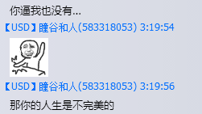

### 人物详解

旭日帝国的老干部。喜欢称 RdMapleKun 为男神。是个变态。

----

## ⌛️看穿一切

*看穿一切* 是从上古内阁群开始流传。当时小天使将 *某某看穿一切* 用在 *小米看穿一切* 图片上，并当表情使用，使得内阁各大小米控翻起prpr（请脑补）的巨浪。后被菜萌重制成：


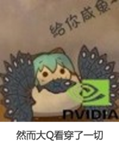


下面是小天使的原图


----

## 🎭灵魂画师

我们上古有一位名为DD的少年，我们都叫他灵魂画师。

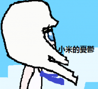
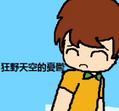
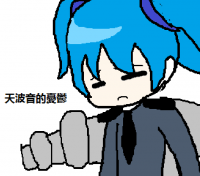
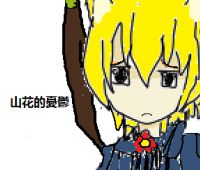
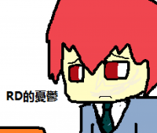
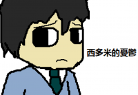

### 舔

当我们说到舔字可以想到舔美味的冰淇淋或者是舔粥碗、舔邮票、舔马桶甚至舔黑猫，不得不说舔字对与某些人来说是总享受。

关于“舔”系列背景故事：~~已删除~~

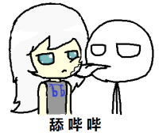
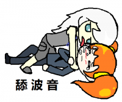
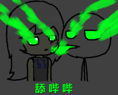
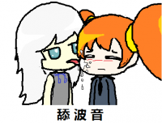
