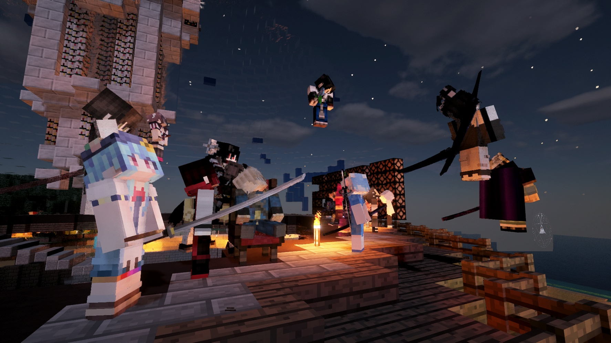

# 上古时代 :id=intro {docsify-ignore-all}

> [!note|label:近期更新 ｜ Recent Updates]
> [城镇生存服][server-survival]已升级至 Minecraft `1.15.2` - [嗡嗡蜂群更新](https://minecraft-zh.gamepedia.com/1.15)

> "上古时代"是一个由一群热爱 Minecraft 的小伙伴创建的小型游戏社区。目前我们有长期稳定开放的 Minecraft 服务器，同时也会偶尔开放一些其他沙盒类的游戏服务器。欢迎一切志同道合的小伙伴加入我们一起来玩！

## 关于本站 :id=about-us

本站主要介绍「上古时代 Minecraft 服务器」的特色内容，也会穿插一点其他游戏服务器的相关信息。如果你想了解 Minecraft 本身的内容与玩法，请访问：[Minecraft 官方百科][mcwiki]。如果是刚接触这款游戏，可以参考：[菜鸟手册][beginner-guide]。

## 联系我们 :id=contact-us

<i class="fab fa-forumbee"></i>[茶馆][bbs] | <i class="fab fa-qq"></i>[QQ交流群][qqgroup] | <i class="fas fa-home"></i>[玩家城镇](https://bbs.mimaru.me/t/towns)

## 加入服务器 :id=join-us

### 前置条件

- 您拥有正版 Minecraft（国际服）。
- 您已阅读并且会遵守[游戏规则](welcome/rules.md)。

如果您没有正版 Minecraft，可以访问 [Minecraft 官网](https://www.minecraft.net/zh-hans/) 购买一个（可能需要梯子）。

### 一切就绪

都准备好啦？选择一个你喜欢的服务器加入吧 <3!

<a class="button" href="#/sur">城镇生存服</a>
<a class="button" href="#/cre">自由创造服</a>
<a class="button" href="#/mod">探索模组服</a>

## 最后 :id=tips

- 有任何疑问欢迎在[QQ群][qqgroup]发问或到[论坛][bbs]发帖 ( * ̀ω*́ )✧
- 服务器的最新动态、改动都会在论坛第一时间发布，还请多多关注论坛哦！

[homepage]: https://www.mimaru.me/
[bbs]: http://bbs.mimaru.me/
[dynmap]: http://map.mimaru.me:8123/
[qqgroup]: http://shang.qq.com/wpa/qunwpa?idkey=6bf79ba005ae8c932177afa1f64ac96d0e6bf7c59f8c393b0f9ef8f3f69d6f15
[mcwiki]: https://minecraft-zh.gamepedia.com/
[beginner-guide]: http://minecraft-zh.gamepedia.com/%E6%95%99%E7%A8%8B/%E8%8F%9C%E9%B8%9F%E6%89%8B%E5%86%8C
[java]: https://www.java.com/zh_CN/download/
[faq]: /welcome/faq.md
[server-survival]: /mc-servers/survival.md
[server-creative]: /mc-servers/creative.md
[server-modded]: /mod
